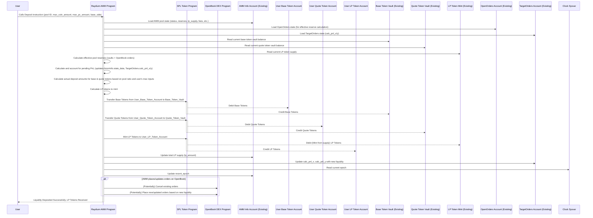

```mermaid
sequenceDiagram
    participant User
    participant AMM_Program as Raydium AMM Program
    participant System_Program as System Program
    participant SPL_Token_Program as SPL Token Program
    participant Rent_Sysvar as Rent Sysvar
    participant OpenBook_DEX_Program as OpenBook DEX Program
    participant Amm_Info_Account as AMM Info Account (New)
    participant LP_Token_Mint as LP Token Mint (New)
    participant Base_Token_Vault as Base Token Vault (New)
    participant Quote_Token_Vault as Quote Token Vault (New)
    participant OpenOrders_Account as OpenOrders Account (New)
    participant TargetOrders_Account as TargetOrders Account (New)
    participant Amm_Config_Account as AMM Config Account (Existing)
    participant User_Base_Token_Account as User Base Token Account
    participant User_Quote_Token_Account as User Quote Token Account
    participant User_LP_Token_Account as User LP Token Account (New)

    User->>AMM_Program: Calls Initialize2 instruction (with initial liquidity, token mints, OpenBook market ID)
    activate AMM_Program

    AMM_Program->>Amm_Config_Account: Reads pool creation fee
    AMM_Program->>User: Charges pool creation fee (if any, via System Program)

    %% Account Creations
    AMM_Program->>System_Program: Create AMM Info Account
    activate System_Program
    System_Program-->>Amm_Info_Account: Account created
    deactivate System_Program
    AMM_Program->>Amm_Info_Account: Initialize AMM Info (status, nonce, decimals, fees, etc.)

    AMM_Program->>System_Program: Create TargetOrders Account
    activate System_Program
    System_Program-->>TargetOrders_Account: Account created
    deactivate System_Program
    AMM_Program->>TargetOrders_Account: Initialize TargetOrders (calc_pnl_x/y based on initial liquidity)

    AMM_Program->>System_Program: Create LP Token Mint Account
    activate System_Program
    System_Program-->>LP_Token_Mint: Account created
    deactivate System_Program
    AMM_Program->>SPL_Token_Program: Initialize LP Token Mint (decimals, mint authority = AMM PDA)
    activate SPL_Token_Program
    SPL_Token_Program-->>LP_Token_Mint: Mint Initialized
    deactivate SPL_Token_Program

    AMM_Program->>System_Program: Create Base Token Vault Account (owned by AMM PDA)
    activate System_Program
    System_Program-->>Base_Token_Vault: Account created
    deactivate System_Program
    AMM_Program->>SPL_Token_Program: Initialize Base Token Vault
    activate SPL_Token_Program
    SPL_Token_Program-->>Base_Token_Vault: Vault Initialized
    deactivate SPL_Token_Program

    AMM_Program->>System_Program: Create Quote Token Vault Account (owned by AMM PDA)
    activate System_Program
    System_Program-->>Quote_Token_Vault: Account created
    deactivate System_Program
    AMM_Program->>SPL_Token_Program: Initialize Quote Token Vault
    activate SPL_Token_Program
    SPL_Token_Program-->>Quote_Token_Vault: Vault Initialized
    deactivate SPL_Token_Program

    AMM_Program->>System_Program: Create OpenOrders Account (for OpenBook DEX)
    activate System_Program
    System_Program-->>OpenOrders_Account: Account created
    deactivate System_Program
    AMM_Program->>OpenBook_DEX_Program: Initialize OpenOrders Account (market, owner = AMM PDA)
    activate OpenBook_DEX_Program
    OpenBook_DEX_Program-->>OpenOrders_Account: OpenOrders Initialized
    deactivate OpenBook_DEX_Program

    %% Initial Liquidity Transfer
    AMM_Program->>SPL_Token_Program: Transfer Base Tokens from User to Base Token Vault
    activate SPL_Token_Program
    SPL_Token_Program-->>User_Base_Token_Account: Debit Base Tokens
    SPL_Token_Program-->>Base_Token_Vault: Credit Base Tokens
    deactivate SPL_Token_Program

    AMM_Program->>SPL_Token_Program: Transfer Quote Tokens from User to Quote Token Vault
    activate SPL_Token_Program
    SPL_Token_Program-->>User_Quote_Token_Account: Debit Quote Tokens
    SPL_Token_Program-->>Quote_Token_Vault: Credit Quote Tokens
    deactivate SPL_Token_Program

    %% Create User's LP ATA (simplified, could be separate instruction by user)
    AMM_Program->>System_Program: (If needed) Create User LP ATA
    AMM_Program->>SPL_Token_Program: (If needed) Initialize User LP ATA

    %% Mint LP Tokens to User
    AMM_Program->>SPL_Token_Program: Mint LP Tokens to User LP Token Account
    activate SPL_Token_Program
    SPL_Token_Program-->>LP_Token_Mint: Debit (Mint) LP Tokens
    SPL_Token_Program-->>User_LP_Token_Account: Credit LP Tokens
    deactivate SPL_Token_Program

    AMM_Program-->>User: Pool Created Successfully
    deactivate AMM_Program
```

```mermaid
sequenceDiagram
    participant User
    participant AMM_Program as Raydium AMM Program
    participant SPL_Token_Program as SPL Token Program
    participant OpenBook_DEX_Program as OpenBook DEX Program
    participant Amm_Info_Account as AMM Info Account (Existing)
    participant User_LP_Token_Account as User LP Token Account
    participant User_Base_Token_Account as User Base Token Account
    participant User_Quote_Token_Account as User Quote Token Account
    participant Base_Token_Vault as Base Token Vault (Existing)
    participant Quote_Token_Vault as Quote Token Vault (Existing)
    participant LP_Token_Mint as LP Token Mint (Existing)
    participant OpenOrders_Account as OpenOrders Account (Existing)
    participant TargetOrders_Account as TargetOrders Account (Existing)
    participant Market_Accounts as OpenBook Market Accounts (Bids, Asks, EventQ, etc.)
    participant Clock_Sysvar as Clock Sysvar

    User->>AMM_Program: Calls Withdraw instruction (pool ID, amount of LP tokens to burn)
    activate AMM_Program

    AMM_Program->>Amm_Info_Account: Load AMM pool state (status, reserves, lp_supply, fees, etc.)
    AMM_Program->>OpenOrders_Account: Load OpenOrders state
    AMM_Program->>TargetOrders_Account: Load TargetOrders state
    AMM_Program->>Base_Token_Vault: Read current base token vault balance
    AMM_Program->>Quote_Token_Vault: Read current quote token vault balance
    AMM_Program->>LP_Token_Mint: Read current LP token supply
    AMM_Program->>User_LP_Token_Account: Read user's LP token balance

    %% Optional: Cancel orders on OpenBook if direct vault liquidity is insufficient
    alt Vault liquidity potentially insufficient OR AMM strategy requires rebalancing
        AMM_Program->>OpenBook_DEX_Program: Cancel some AMM orders on OpenBook (via OpenOrders_Account, Market_Accounts)
        activate OpenBook_DEX_Program
        OpenBook_DEX_Program-->>AMM_Program: Orders Cancelled
        deactivate OpenBook_DEX_Program

        AMM_Program->>OpenBook_DEX_Program: Settle funds from OpenOrders_Account to AMM Vaults (Base_Token_Vault, Quote_Token_Vault)
        activate OpenBook_DEX_Program
        OpenBook_DEX_Program-->>Base_Token_Vault: Credit Base Tokens
        OpenBook_DEX_Program-->>Quote_Token_Vault: Credit Quote Tokens
        deactivate OpenBook_DEX_Program

        AMM_Program->>Base_Token_Vault: Re-read base token vault balance
        AMM_Program->>Quote_Token_Vault: Re-read quote token vault balance
    end

    %% PnL Calculation (Simplified)
    AMM_Program->>AMM_Program: Calculate effective pool reserves (vaults + remaining OpenBook orders)
    AMM_Program->>AMM_Program: Calculate and account for pending PnL (updates AmmInfo.state_data, TargetOrders.calc_pnl_x/y)

    %% Determine Token Amounts to Return
    AMM_Program->>AMM_Program: Calculate amounts of Base and Quote tokens to return based on LP tokens burned and effective reserves

    %% Burn User's LP Tokens
    AMM_Program->>SPL_Token_Program: Burn LP Tokens from User_LP_Token_Account
    activate SPL_Token_Program
    SPL_Token_Program-->>User_LP_Token_Account: Debit LP Tokens
    SPL_Token_Program-->>LP_Token_Mint: Credit (Burn to supply) LP Tokens
    deactivate SPL_Token_Program

    %% Token Transfers from Vaults to User
    AMM_Program->>SPL_Token_Program: Transfer Base Tokens from Base_Token_Vault to User_Base_Token_Account
    activate SPL_Token_Program
    SPL_Token_Program-->>Base_Token_Vault: Debit Base Tokens
    SPL_Token_Program-->>User_Base_Token_Account: Credit Base Tokens
    deactivate SPL_Token_Program

    AMM_Program->>SPL_Token_Program: Transfer Quote Tokens from Quote_Token_Vault to User_Quote_Token_Account
    activate SPL_Token_Program
    SPL_Token_Program-->>Quote_Token_Vault: Debit Quote Tokens
    SPL_Token_Program-->>User_Quote_Token_Account: Credit Quote Tokens
    deactivate SPL_Token_Program

    %% Update AMM State
    AMM_Program->>Amm_Info_Account: Update total LP supply (lp_amount)
    AMM_Program->>TargetOrders_Account: Update calc_pnl_x, calc_pnl_y with new liquidity
    AMM_Program->>Clock_Sysvar: Read current epoch
    AMM_Program->>Amm_Info_Account: Update recent_epoch

    %% Optional: If AMM strategy involves rebalancing remaining orders on OpenBook
    alt AMM rebalances remaining orders
        AMM_Program->>OpenBook_DEX_Program: (Potentially) Cancel/Place new/updated orders based on new liquidity state
    end

    AMM_Program-->>User: Liquidity Withdrawn Successfully, Tokens Received
    deactivate AMM_Program
```

```mermaid
sequenceDiagram
    participant User
    participant AMM_Program as Raydium AMM Program
    participant SPL_Token_Program as SPL Token Program
    participant OpenBook_DEX_Program as OpenBook DEX Program
    participant Amm_Info_Account as AMM Info Account (Existing)
    participant User_Source_Token_Account as User Source Token Account
    participant User_Destination_Token_Account as User Destination Token Account
    participant Base_Token_Vault as Base Token Vault (Existing)
    participant Quote_Token_Vault as Quote Token Vault (Existing)
    participant OpenOrders_Account as OpenOrders Account (Existing)
    participant TargetOrders_Account as TargetOrders Account (Existing)
    participant OB_Market_Accounts as OpenBook Market (Bids, Asks, EventQ, ReqQ, Market Vaults)
    participant Clock_Sysvar as Clock Sysvar

    User->>AMM_Program: Calls Swap instruction (e.g., SwapBaseIn: pool ID, amount_in, min_amount_out)
    activate AMM_Program

    AMM_Program->>Amm_Info_Account: Load AMM pool state (status, reserves, fees, OpenBook market details, etc.)
    AMM_Program->>OpenOrders_Account: Load OpenOrders state (for effective reserve calculation & order placement)
    AMM_Program->>TargetOrders_Account: Load TargetOrders state (potentially, though less direct impact on pure swaps)
    AMM_Program->>Base_Token_Vault: Read current base token vault balance
    AMM_Program->>Quote_Token_Vault: Read current quote token vault balance

    %% Determine Swap Path & Calculate Amounts
    AMM_Program->>AMM_Program: Determine if swap is Coin2PC or PC2Coin
    AMM_Program->>AMM_Program: Calculate effective pool reserves (vaults + OpenBook orders if applicable for pricing)

    alt Swap against internal AMM liquidity primarily
        AMM_Program->>AMM_Program: Calculate swap output amount using constant product (x*y=k), deduct fees
        AMM_Program->>AMM_Program: Check slippage against min_amount_out

        %% Token Transfer: User to AMM Vault (Input Token)
        Note over User_Source_Token_Account, Base_Token_Vault: Assume Source is Base, Dest is Quote for this example
        AMM_Program->>SPL_Token_Program: Transfer Input Tokens from User_Source_Token_Account to appropriate AMM Vault (e.g., Base_Token_Vault)
        activate SPL_Token_Program
        SPL_Token_Program-->>User_Source_Token_Account: Debit Input Tokens
        SPL_Token_Program-->>Base_Token_Vault: Credit Input Tokens
        deactivate SPL_Token_Program

        %% Token Transfer: AMM Vault to User (Output Token)
        AMM_Program->>SPL_Token_Program: Transfer Output Tokens from appropriate AMM Vault (e.g., Quote_Token_Vault) to User_Destination_Token_Account
        activate SPL_Token_Program
        SPL_Token_Program-->>Quote_Token_Vault: Debit Output Tokens
        SPL_Token_Program-->>User_Destination_Token_Account: Credit Output Tokens
        deactivate SPL_Token_Program

    else Swap involves interaction with OpenBook DEX (more complex, simplified here)
        %% This path is highly complex and often part of MonitorStep; Swap instruction might simplify this.
        %% For a direct swap that *could* use OpenBook, the AMM might:
        AMM_Program->>OB_Market_Accounts: Read OpenBook order book (Bids, Asks)
        AMM_Program->>AMM_Program: Determine if matching on OpenBook offers better price or is necessary

        %% Example: AMM takes liquidity from OpenBook or places an order that gets filled
        AMM_Program->>OpenBook_DEX_Program: Potentially cancel some of its own orders on OpenBook
        AMM_Program->>OpenBook_DEX_Program: Place order(s) on OpenBook market (via OpenOrders_Account, OB_Market_Accounts)
        activate OpenBook_DEX_Program
        OpenBook_DEX_Program-->>OB_Market_Accounts: Order matched / filled
        deactivate OpenBook_DEX_Program

        AMM_Program->>OpenBook_DEX_Program: Settle funds from OpenBook (via OpenOrders_Account, OB_Market_Accounts) to AMM Vaults
        activate OpenBook_DEX_Program
        OpenBook_DEX_Program-->>Base_Token_Vault: +/- Base Tokens
        OpenBook_DEX_Program-->>Quote_Token_Vault: +/- Quote Tokens
        deactivate OpenBook_DEX_Program

        %% Then proceeds with transfers to/from user based on settled amounts
        AMM_Program->>SPL_Token_Program: Transfer Input Tokens from User_Source_Token_Account to AMM Vault
        AMM_Program->>SPL_Token_Program: Transfer Output Tokens from AMM Vault to User_Destination_Token_Account
    end

    %% Update AMM State
    AMM_Program->>Amm_Info_Account: Update statistical data (swap volumes, accumulated fees in state_data)
    AMM_Program->>Clock_Sysvar: Read current epoch
    AMM_Program->>Amm_Info_Account: Update recent_epoch

    AMM_Program-->>User: Swap Successful, Tokens Received
    deactivate AMM_Program

Note right of AMM_Program: The actual interaction with OpenBook for a single swap can be very complex, involving the AMM's order book management strategy (MonitorStep). A direct Swap instruction might prioritize internal AMM liquidity or a simplified interaction with OpenBook. This diagram shows a high-level view.
```

# Raydium AMM User Flows

This document describes the key user flows when interacting with the Raydium AMM protocol. Each flow outlines the steps, inputs, outputs, and core operations involved.

## 1. Creating a Liquidity Pool

This flow describes how a new liquidity pool is created for a pair of tokens.

**Pre-requisites:**
*   An existing OpenBook DEX market must already be deployed for the token pair. Raydium AMM integrates with and shares liquidity with this market.
*   The creator must have authority and sufficient funds to initialize the pool and provide initial liquidity.
*   The token mints for both tokens in the pair must exist.

**Inputs Required:**
*   Nonce for PDA generation.
*   Open time for the pool (when trading can begin).
*   Initial amount of PC (Price Currency) tokens to deposit.
*   Initial amount of Coin tokens to deposit.
*   References to the OpenBook market program ID, market ID.
*   References to the two token mints (Coin and PC).
*   User's wallet and token accounts for the initial liquidity deposit.

**Accounts Created/Initialized:**
*   **AMM Info Account (`AmmInfo`):** Stores all parameters and state for the new pool.
*   **LP Token Mint Account:** A new SPL token mint for the Liquidity Provider (LP) tokens specific to this pool.
*   **Coin Token Vault:** An SPL token account (owned by AMM Authority PDA) to hold the Coin tokens.
*   **PC Token Vault:** An SPL token account (owned by AMM Authority PDA) to hold the PC tokens.
*   **OpenOrders Account:** An account for the AMM on the associated OpenBook market, allowing the AMM to place orders, controlled by the AMM Authority PDA.
*   **TargetOrders Account:** Stores the AMM's planned limit orders for the OpenBook DEX, controlled by the AMM Authority PDA.
*   **(Potentially) Associated Token Accounts (ATAs):** User's LP token ATA is also created if it doesn't exist.

**Key Operations (primarily via `Initialize2` instruction):**
1.  **Fee Payment:** The user pays a one-time fee (if configured in the global `AmmConfig` account) for creating the pool.
2.  **PDA Generation:** Program Derived Addresses (PDAs) are determined for the AMM authority, token vaults, LP mint, AMM info account, OpenOrders account, and TargetOrders account based on the Raydium AMM program ID and specific seeds.
3.  **Account Creation & Initialization:**
    *   The `AmmInfo`, `TargetOrders`, LP Mint, Coin Vault, and PC Vault accounts are created (space allocated via System Program) and initialized with provided parameters (nonce, open time, token decimals, lot sizes derived from the OpenBook market, fee settings from `AmmInfo` defaults).
    *   The OpenOrders account is created and initialized on the OpenBook DEX market, with the AMM Authority PDA as its owner.
4.  **Initial Liquidity Deposit:**
    *   The creator's specified amounts of Coin and PC tokens are transferred from their source token accounts into the newly created Coin and PC Token Vaults respectively.
5.  **LP Token Minting:**
    *   Based on the initial liquidity deposited, a corresponding amount of LP tokens is minted to the creator's LP token account. The amount is typically calculated using the geometric mean of the initial token amounts (`sqrt(coin_amount * pc_amount)`), adjusted by subtracting a small fixed amount (`10^lp_decimals`) to prevent certain exploits.
6.  **State Update:** The `AmmInfo` account is populated with all pool parameters. Its status is set (e.g., `WaitingTrade` or `SwapOnly` depending on `open_time`).
7.  The `TargetOrders` account is initialized, with `calc_pnl_x` and `calc_pnl_y` set to the normalized values of the initial PC and Coin liquidity, establishing the baseline for future PnL calculations.

**Flow Diagram:**

---

## 2. Depositing Liquidity

This flow describes how a user adds liquidity to an existing pool and receives LP tokens in return.

**Inputs Required:**
*   Pool Identifier (e.g., AMM Info account public key).
*   Maximum amount of Coin token the user is willing to deposit.
*   Maximum amount of PC token the user is willing to deposit.
*   `base_side`: Indicates which token amount (`max_coin_amount` or `max_pc_amount`) is the primary reference for calculating the deposit ratio. `0` for Coin as base, `1` for PC as base.
*   (Optional) `other_amount_min`: Minimum amount of the non-base token the user expects to deposit, providing slippage control.
*   User's wallet and source token accounts for Coin and PC tokens.
*   User's destination LP token account.

**LP Tokens Minted:**
*   The number of LP tokens minted is proportional to the user's share of the total effective liquidity after their deposit.
*   The calculation is based on the current ratio of tokens in the pool (effective reserves, considering tokens in vaults and potentially on OpenBook) and the amount of tokens the user deposits. The AMM tries to maintain the existing price ratio.
*   If `base_side` is Coin, the amount of PC token to deposit is calculated proportionally: `pc_to_deposit = max_coin_amount * current_pc_reserve / current_coin_reserve` (using ceiling rounding). If this calculated `pc_to_deposit` exceeds the user's `max_pc_amount`, the transaction may fail due to slippage. A similar calculation applies if `base_side` is PC.

**How Liquidity is Added:**
1.  The user's Coin and PC tokens (actual amounts determined by the AMM based on pool ratio and user inputs) are transferred from their accounts into the AMM's Coin and PC vaults.
2.  The `AmmInfo` state (specifically `lp_amount`) is updated to reflect the newly minted LP tokens.
3.  The PnL baseline in the `TargetOrders` account (`calc_pnl_x`, `calc_pnl_y`) is updated to reflect the new total liquidity, which influences future order calculations for OpenBook and PnL calculations.
4.  Profit and Loss (PnL) that has accrued in the pool since the last PnL update is calculated and set aside before determining the deposit ratio and LP amount for the new depositor. This ensures fairness to existing LPs.

**Key Operations (primarily via `Deposit` instruction):**
1.  **Load State:** The current state of the AMM pool (`AmmInfo`, `TargetOrders`, vault balances, OpenBook `OpenOrders` state) is loaded.
2.  **Calculate PnL:** Pending PnL for the pool is calculated using `Processor::calc_take_pnl`. This adjusts the effective reserves used for deposit calculations and updates PnL tracking fields in `AmmInfo.state_data` and `TargetOrders`.
3.  **Determine Deposit Amounts:** Based on the PnL-adjusted current pool ratio and the user's `max_coin_amount`, `max_pc_amount`, and `base_side`, the actual amounts of Coin (`deduct_coin_amount`) and PC tokens (`deduct_pc_amount`) to be deposited are determined using `InvariantToken::exchange_coin_to_pc` or `exchange_pc_to_coin` (with ceiling rounding for the second token). Slippage checks against `other_amount_min` and `max_pc_amount`/`max_coin_amount` are performed.
4.  **Calculate LP Tokens to Mint:** Using `InvariantPool::exchange_token_to_pool` (with floor rounding), the amount of LP tokens (`mint_lp_amount`) to be minted is calculated based on the `deduct_coin_amount` (or `deduct_pc_amount`) relative to the PnL-adjusted total effective reserves.
5.  **Token Transfer:** The `deduct_coin_amount` and `deduct_pc_amount` are transferred from the user's accounts to the AMM's vaults.
6.  **Mint LP Tokens:** `mint_lp_amount` of LP tokens is minted to the user's LP token account.
7.  **Update State:** `AmmInfo.lp_amount` is increased. `TargetOrders.calc_pnl_x` and `calc_pnl_y` are updated with the newly added liquidity (normalized and adjusted for the PnL that was set aside). `AmmInfo.recent_epoch` is updated.

**Flow Diagram:**

---

## 3. Withdrawing Liquidity

This flow describes how a user burns their LP tokens to withdraw their share of liquidity from the pool.

**Inputs Required:**
*   Pool Identifier (e.g., AMM Info account public key).
*   Amount of LP tokens the user wishes to burn.
*   (Optional) `min_coin_amount`, `min_pc_amount`: Minimum amounts of Coin and PC tokens the user expects to receive, for slippage control.
*   User's wallet and source LP token account.
*   User's destination token accounts for Coin and PC tokens.

**Calculation of Tokens Returned:**
*   The amount of Coin and PC tokens returned is proportional to the user's share of the total effective liquidity, represented by the LP tokens they burn.
*   Calculation: `coin_to_return = (LP_tokens_to_burn / total_LP_supply) * total_effective_coin_in_pool` (similarly for PC tokens). The "total_effective_coin_in_pool" considers tokens in vaults and on OpenBook, adjusted for PnL.

**How Liquidity is Removed:**
1.  If the AMM operates with an order book, it first cancels all its orders on OpenBook to consolidate liquidity.
2.  Funds are settled from OpenBook's DEX vaults (via the AMM's OpenOrders account) to the AMM's main token vaults.
3.  Accrued PnL is calculated and set aside (unless the pool is in WithdrawOnly mode).
4.  The amounts of Coin and PC tokens corresponding to the user's burned LP tokens are calculated based on the PnL-adjusted effective reserves.
5.  These token amounts are transferred from the AMM's vaults to the user's token accounts.
6.  The user's LP tokens are burned.
7.  The `AmmInfo` state (`lp_amount`) and `TargetOrders` PnL baseline (`calc_pnl_x`, `calc_pnl_y`) are updated.

**Key Operations (primarily via `Withdraw` instruction):**
1.  **Load State:** Current state of the AMM pool and OpenBook orders is loaded.
2.  **Order Cancellation & Settlement (if applicable):** If the pool interacts with OpenBook, all AMM orders are cancelled (`Processor::do_cancel_amm_orders`), and funds are settled back to AMM vaults (`Invokers::invoke_dex_settle_funds`).
3.  **Calculate PnL:** Pending PnL is calculated via `Processor::calc_take_pnl` (unless in `WithdrawOnly` status), adjusting effective reserves and updating PnL tracking state.
4.  **Determine Withdrawal Amounts:** Based on the LP tokens to burn (`withdraw.amount`) and the PnL-adjusted total effective liquidity, the amounts of Coin and PC tokens to be returned (`coin_amount`, `pc_amount`) are calculated using `InvariantPool::exchange_pool_to_token` (with floor rounding). Slippage checks against `min_coin_amount` and `min_pc_amount` are performed if provided.
5.  **Token Transfer:** The calculated `coin_amount` and `pc_amount` are transferred from the AMM's vaults to the user's accounts.
6.  **Burn LP Tokens:** The user's specified `withdraw.amount` of LP tokens is burned from their account.
7.  **Update State:** `AmmInfo.lp_amount` is decreased. `TargetOrders.calc_pnl_x` and `calc_pnl_y` are updated by subtracting the normalized withdrawn amounts and PnL adjustments. `AmmInfo.recent_epoch` is updated.

**Flow Diagram:**

---

## 4. Swapping Tokens

This flow describes how a user exchanges one token for another using the AMM.

**Inputs Required:**
*   Pool Identifier (e.g., AMM Info account public key).
*   Input token mint and the amount of the input token (`amount_in`).
*   Output token mint.
*   Minimum amount of the output token the user is willing to receive (`minimum_amount_out`) to control slippage.
*   User's wallet, source token account (for the input token), and destination token account (for the output token).

**Swap Amount Calculation:**
*   The core calculation uses the constant product formula (`x * y = k`).
*   If swapping Token A for Token B: `amount_out_B = (pool_B_reserve * amount_in_A_after_fees) / (pool_A_reserve + amount_in_A_after_fees)`.
*   The actual reserves considered (`pool_A_reserve`, `pool_B_reserve`) are the effective amounts in the AMM, including liquidity in vaults and potentially on OpenBook, but *not* adjusted for pending PnL during the swap itself.
*   A swap fee (e.g., 0.25%) is deducted from the `amount_in` before calculating the output amount. The fee calculation uses ceiling rounding.
*   If the calculated `amount_out` is less than `minimum_amount_out` specified by the user, the transaction fails due to slippage.

**Interaction with Liquidity Sources:**
*   **Internal AMM Pool:** The swap primarily occurs against the liquidity held in the AMM's vaults.
*   **OpenBook DEX (Indirect Interaction during Swaps):**
    *   Before executing the swap against its internal pool, the AMM cancels its own resting limit orders on the OpenBook DEX for the side that would be adversely affected by the swap (e.g., cancels its bids if user is selling Coin, or asks if user is buying Coin). This prevents the user's swap from trading against the AMM's own stale orders at potentially worse prices for the AMM.
    *   If the AMM's vaults do not have enough of the output token (because much of it is locked in its OpenOrders account on the DEX), it will attempt to settle funds from its OpenOrders account back to its vaults.
    *   The swap itself, as processed by `SwapBaseIn` or `SwapBaseOut`, primarily uses the AMM's (now consolidated) vault liquidity. The AMM's `MonitorStep` instruction is responsible for later re-placing orders on OpenBook based on the new pool balances.

**Key Operations (primarily via `SwapBaseIn` or `SwapBaseOut` instructions):**
1.  **Load State:** Current state of the AMM pool (`AmmInfo`, vault balances, OpenBook `OpenOrders` if applicable).
2.  **Determine Swap Direction:** Based on input and output token mints.
3.  **Calculate Effective Reserves:** Uses `Calculator::calc_total_without_take_pnl` (or its `_no_orderbook` variant) to determine current effective PC and Coin amounts.
4.  **Fee Calculation:** `swap_fee` is calculated on `amount_in` using `amm.fees.swap_fee_numerator/denominator` and ceiling rounding. `swap_in_after_deduct_fee = amount_in - swap_fee`.
5.  **Calculate Swap Output/Input:**
    *   For `SwapBaseIn`: `swap_amount_out = Calculator::swap_token_amount_base_in(swap_in_after_deduct_fee, ...)` using floor division.
    *   For `SwapBaseOut`: `swap_in_before_add_fee = Calculator::swap_token_amount_base_out(amount_out, ...)` using ceiling division. Then `swap_in_after_add_fee` is calculated to include fees, also using ceiling division.
6.  **Slippage & Validity Checks:** Ensure calculated amounts meet user's `minimum_amount_out` or `max_amount_in`, and that amounts are non-zero and do not exceed pool reserves.
7.  **OpenBook Order Management (if applicable):** Cancel relevant AMM orders on OpenBook. Settle funds if vault balances for output token are insufficient.
8.  **Token Transfers:**
    *   Transfer the input token amount from the user's source account to the corresponding AMM vault.
    *   Transfer the calculated output token amount from the corresponding AMM vault to the user's destination account.
9.  **Update State:**
    *   The `AmmInfo.state_data` (e.g., `swap_coin_in_amount`, `swap_pc_out_amount`, `swap_acc_coin_fee`) is updated to record swap volume and fees.
    *   `AmmInfo.recent_epoch` is updated.
    *   The PnL baseline (`TargetOrders.calc_pnl_x/y`) is *not* directly updated by swaps; accumulated swap fees contribute to PnL over time, which is then processed during deposits, withdrawals, or `MonitorStep`.

**Flow Diagram:**

